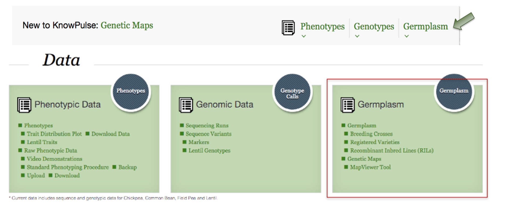
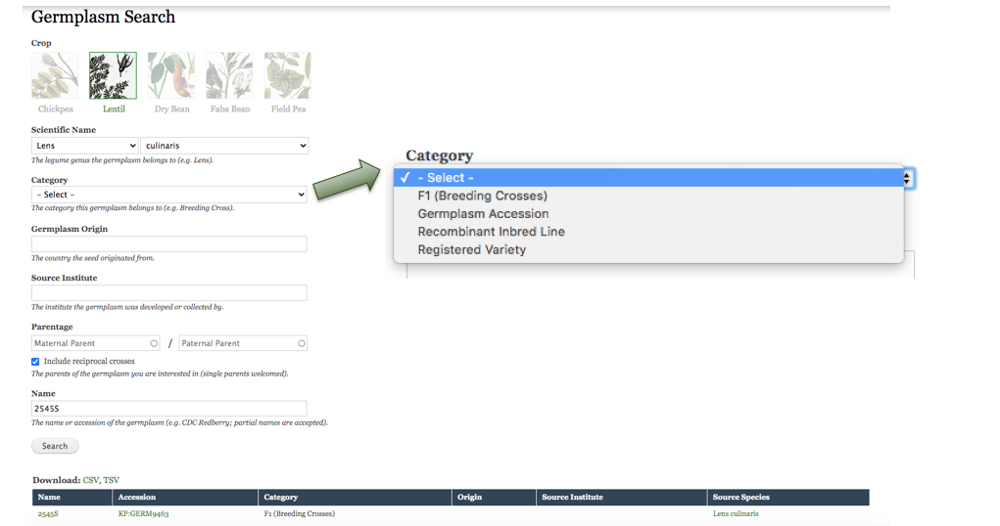
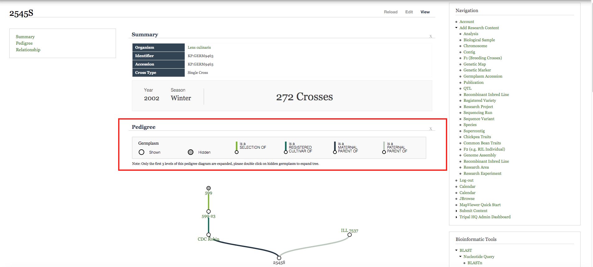
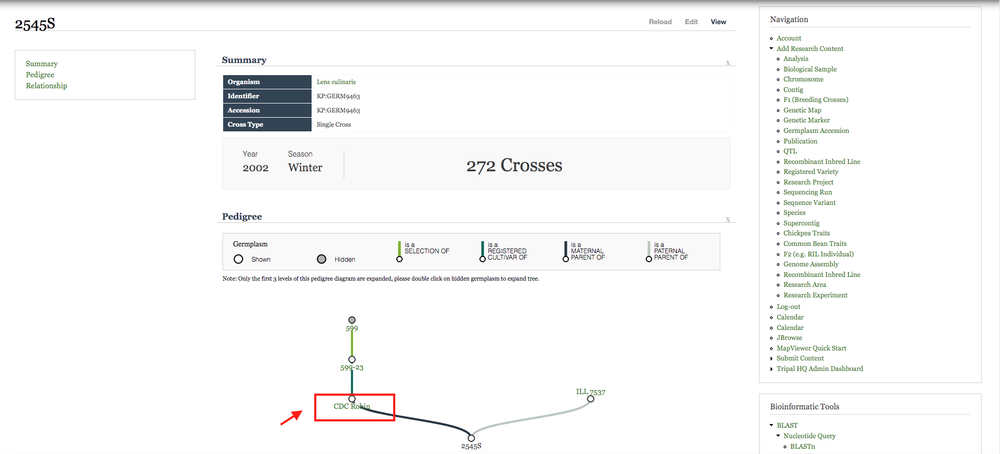
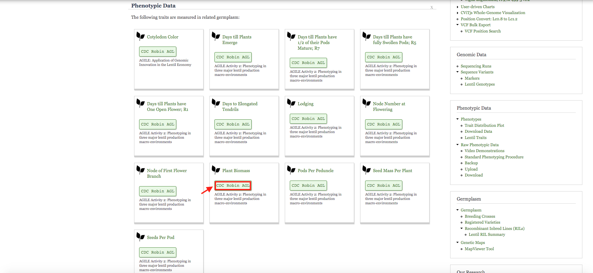
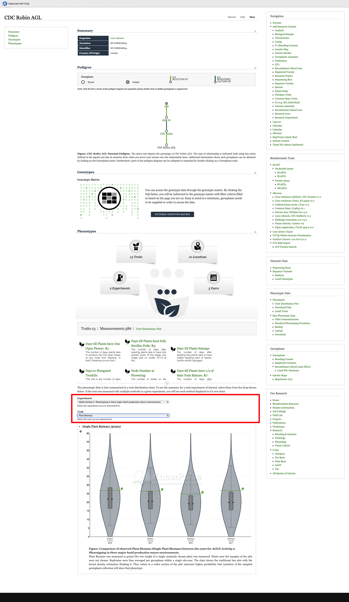

## Lentil Breeging Scenario
When you land on the Knowpulse home page, right-click on Germplasm on the top banner, it brings you to the data section. 

So simply, you go to the germplasm search and click on the image of the targeted crop, then the genus will be filled by default. Here, I am using *Lens culinaris* to walk you through. You are encouraged to choose the species name specifically to narrow down the results. Also, there is a category drop down to select which category the germplasm belongs to. The more information you put in, the easier it is to find the individual you are looking for.

I am using 2545S as an example to show the pedigree chart. The legend here shows us how each selection looks like. The shaded nodes are clickable, this means there is parental data for them. By double clicking on them, you are able to trace the full tree diagram for 2545S.

2545S has CDC Robin as its maternal parent, let us look it into details. 

Therefore, we scroll all the way down to see its phenotypic data, and these are the measured phenotypic traits for CDC Robin AGL. To see the values for any interesting trait, for example `Plant Biomass`, make sure you click on the CDC Robin AGL box, this will bring you to the germplasm page for CDC Robin AGL. On this page, a trait distribution chart can be viewed on the bottom.

Use the drop-down to select AGILE Activity 2, then select plant biomass; now a violin plot is generated automatically. The x-axis here shows the year and growing locations while the y-axis shows the single plant biomass in grams.

