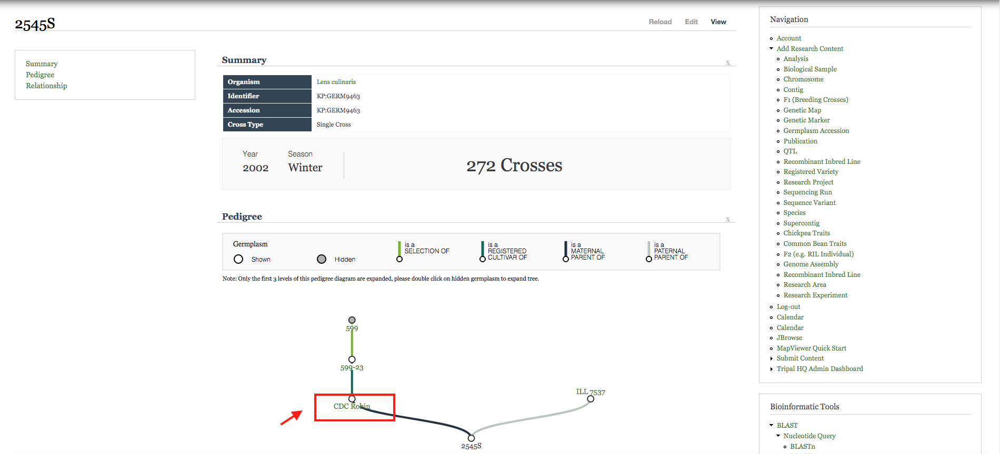

I am using 2545S as an example to show the pedigree chart. The legend here shows us how each selection looks like. The shaded nodes are clickable, this means there is parental data for them. By double clicking on them, you are able to trace the full tree diagram for 2545S.

We notice 2545S has CDC Robin as its maternal parent, let us look it into details. 

