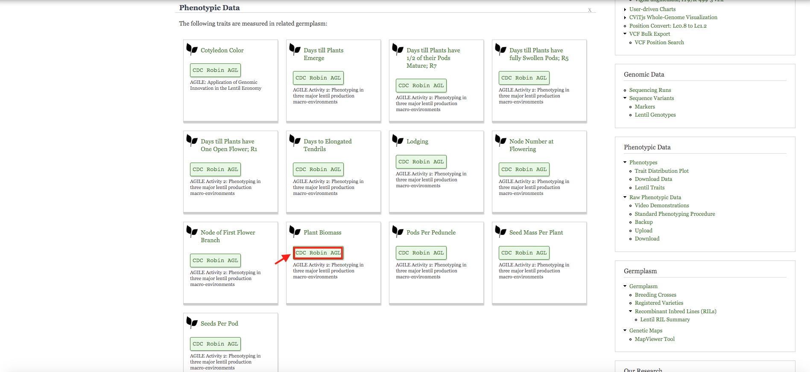

After landing on CDC Robin's home page, you scroll down to the bottom to see the availability of phenotypic data. When taking a precious look at the phenotypic data section, you may notice `CDC Robin AGL,`which is slightly different from `CDC Robin`.To see the values for any interesting trait, for example Plant Biomass, make sure you click on the CDC Robin AGL box, this will bring you to the germplasm page for CDC Robin AGL. On this page, a trait distribution chart can be viewed on the bottom.

Use the drop-down to select `AGILE Activity 2`, then select `plant biomass`; now a violin plot is generated automatically. The x-axis here shows the year and growing locations while the y-axis shows the single plant biomass in grams. You can see distribution of the trait across multiple site years.

