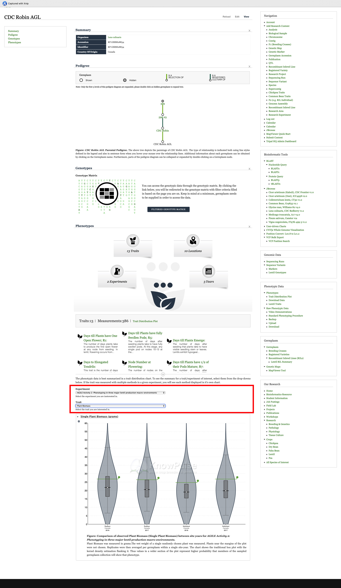

Use the drop-down to select `AGILE Activity 2`, then select `plant biomass`; now a violin plot is generated automatically. The x-axis here shows the year and growing locations while the y-axis shows the single plant biomass in grams. You can see distribution of the trait across multiple site years.

